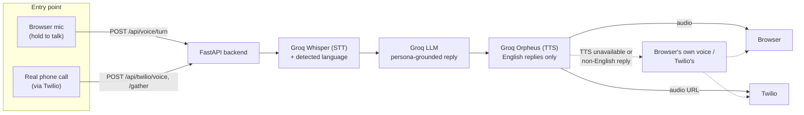

# Private Voice Assistant

An AI-powered voice helpline — the kind of assistant a telecom (Jazz) or a
bank could put in front of an IVR: the caller speaks, the assistant
listens, understands, and answers back out loud, grounded in that
company's own facts, in whatever language the caller used.

Two ways to reach it:

- **Browser demo** — open a web page, click "Call," talk into your
  microphone. Works immediately, no phone infrastructure needed.
- **Real phone calls** — via Twilio, so anyone can dial an actual phone
  number and talk to it. Needs your own Twilio account (see
  [Real phone calls (Twilio)](#real-phone-calls-twilio) below) - that
  part can't be tested without one, so it's on you to verify end-to-end.

## How it works

One Groq API key drives the whole pipeline for both entry points:



1. **Listen** — speech goes to Groq's **Whisper** model, which returns
   both the transcript and the detected language.
2. **Think** — the transcript, conversation so far, and detected
   language go to a **Groq-hosted LLM** with a system prompt for whichever
   company persona is active (see `backend/app/personas.py`). The persona
   stays in scope, never invents real account data, replies in the
   caller's own language, and offers a human handoff when it can't help.
3. **Speak** — English replies go to Groq's **Orpheus** TTS model
   (Orpheus is English-only). Non-English replies, or any Groq TTS
   failure, fall back to the browser's built-in voice (or Twilio's
   `<Say>` on a real call) instead - so a caller always gets a spoken
   reply, just not always in Groq's voice.

The backend is stateless for the browser flow (conversation history lives
in the browser tab, sent back each turn); for real calls, history lives
in server memory keyed by Twilio's CallSid (`app/conversation_store.py`),
since a phone call has no tab to hold it in.

## Project layout

```
backend/    FastAPI app (Groq STT/LLM/TTS wrapper, persona config, browser + Twilio APIs)
frontend/   React + TypeScript call UI (Vite) - the browser demo only
```

## Prerequisites

- Python 3.11+
- Node.js 20+ (or Docker, if you don't have Node installed - see below)
- A free [Groq API key](https://console.groq.com/keys)
- Chrome or Edge (for microphone recording + the browser voice fallback)
- A [Twilio account](https://www.twilio.com/try-twilio) + [ngrok](https://ngrok.com/) - only if you want real phone calls, not for the browser demo

## Setup (browser demo)

### 1. Backend

```bash
cd backend
python -m venv .venv
.venv\Scripts\activate        # Windows
# source .venv/bin/activate   # macOS/Linux
pip install -r requirements.txt

copy .env.example .env        # Windows: copy, macOS/Linux: cp
# then edit .env and set GROQ_API_KEY

uvicorn app.main:app --reload --port 8010
```

### 2. Frontend

```bash
cd frontend
npm install
copy .env.example .env   # already points at http://localhost:8010 by default
npm run dev
```

Open **http://localhost:5180** (pinned in `vite.config.ts` - not Vite's
default 5173, which collides with another project on this machine; see
"Why port 5180" below). Pick a persona, press **Call**, then hold **Hold
to talk** while you speak and release to send. Speak in any supported
language (see [Multilingual replies](#multilingual-replies)) and the
reply comes back in that same language.

No Node.js installed? Run the frontend via Docker instead:

```bash
docker run --rm -it -p 5180:5180 -v "${PWD}/frontend:/app" -w /app node:20-alpine sh -c "npm install && npm run dev -- --host 0.0.0.0"
```

### 3. (Optional) Run both with Docker Compose

```bash
docker compose up --build
```

Backend on `:8010`, frontend on `:4180`.

## Real phone calls (Twilio)

This lets someone dial an actual phone number and talk to the same
persona pipeline the browser demo uses - `backend/app/api/twilio_voice.py`
handles it. **This requires your own Twilio account and cannot be
verified without one** - what's been tested here is that the webhook
endpoints return correct TwiML for requests shaped exactly like Twilio's
(see `backend/tests/test_twilio_voice.py`), not an actual live call.

1. **Create a Twilio account** at twilio.com (a free trial account works
   - inbound calls to your own Twilio number work fine on a trial,
   unlike outbound calls, which trial accounts restrict).
2. **Buy/claim a phone number** in the Twilio console with Voice
   capability.
3. **Expose your local backend publicly** (Twilio's servers need to reach
   it - `localhost` means nothing to them):
   ```bash
   ngrok http 8010
   ```
   Copy the `https://*.ngrok-free.app` URL it prints.
4. **Set `PUBLIC_BASE_URL`** in `backend/.env` to that ngrok URL, and set
   `TWILIO_DEFAULT_PERSONA` to whichever persona should answer (`jazz` or
   `bank`). Restart the backend so it picks up the new `.env` values.
5. **Point the phone number's webhook at your backend**: in the Twilio
   console, open the number's configuration, and under "A call comes in"
   set the webhook to `https://<your-ngrok-url>/api/twilio/voice`
   (HTTP POST).
6. **Call the number.** It should answer with the persona's greeting and
   respond to what you say, turn by turn, using the same Groq pipeline as
   the browser demo - just with Twilio's own speech recognition instead
   of Groq Whisper for the caller's side (see the module docstring in
   `twilio_voice.py` for why: Twilio only exposes raw call audio via a
   WebSocket media stream, which would need real-time buffering and
   transcoding to hand to Whisper - a larger undertaking than this
   demo covers, and Twilio's `<Gather input="speech">` already does
   speech-to-text and simply hands back the transcript).

Every ngrok restart gives you a new URL (unless you're on a paid ngrok
plan) - update both `PUBLIC_BASE_URL` and the Twilio console webhook each
time, or deploy the backend somewhere with a stable URL instead.

## Why port 8010 / 5180 (not the usual 8000 / 5173)

Both of those common defaults were already occupied by another project's
services on the machine this was built on (a Docker container relaying
port 8000 for a different backend, and another dev server on the IPv6
loopback for 5173) - the app's own port and someone else's silently
overlapping is exactly the kind of bug that's miserable to debug, since
whichever one wins depends on how your OS resolves "localhost" that day.
8010 and 5180 (backend/frontend) and 4180 (the Docker Compose production
frontend) were picked after confirming with `netstat` that nothing else
on the machine uses them. They're pinned in `vite.config.ts`
(`strictPort: true` - the dev server refuses to silently start on a
different port), `backend/.env` / `frontend/.env`, both Dockerfiles, and
`docker-compose.yml`, so there's one number to change (in all of those
places) if you ever need a different port on your own machine, rather
than something drifting silently.

## Multilingual replies

Whisper detects the language of what the caller said; that detected
language is embedded directly in the message sent to the LLM (e.g.
`[Reply only in Urdu.] <transcript>`), and the persona's own system
prompt also instructs it to match the caller's language. This is
probabilistic, not guaranteed - the smaller/faster model used for low
latency (see below) complies the large majority of the time but not
100% of the time; a retried question almost always succeeds if it
doesn't on the first try.

Voice output is more limited than text: Groq's Orpheus TTS model is
**English-only**. A non-English reply is sent back as text only, and the
frontend speaks it with the browser's own voice (set to the detected
language's locale, e.g. `ur-PK` for Urdu) instead of Groq's. On a real
phone call, Twilio's `<Say>` plays the same role. Only English replies
use Groq's higher-quality voice.

## Groq's own voice (Orpheus TTS)

Voice replies are synthesized by Groq's `canopylabs/orpheus-v1-english`
model (Groq's previous TTS model, `playai-tts`, has been decommissioned).
Orpheus requires a one-time terms acceptance by the org admin at
https://console.groq.com/playground?model=canopylabs%2Forpheus-v1-english
- already done for this project's API key. It also has a modest free-tier
daily token quota; once that's hit, TTS calls fail until it resets.

If synthesis ever fails for any reason (terms not accepted on a different
key, quota exceeded, a transient Groq error, a non-English reply), it
fails gracefully - the backend still returns the assistant's text reply,
and the caller hears the browser's or Twilio's own voice instead. No
restart or code change is needed; the next reply retries Groq's voice
automatically.

## Latency

A full turn (listen → think → speak) takes roughly **2-2.7 seconds** once
the server's been running for a bit - dominated by Orpheus voice
generation (~1.6s of that), which is close to the practical floor for
this architecture without switching to a token-by-token streaming design.
Two things specifically keep this from feeling slower than that:

- **Startup warm-up** (`app/main.py`'s `_warm_up_groq`): the very first
  request after a cold server start pays an extra few seconds for Groq's
  TLS/connection setup on top of normal latency. The backend pre-opens
  that connection and pre-synthesizes each persona's greeting at startup
  (in a background thread, so it doesn't delay the server coming up), so
  a real user's first "Call" press never pays that cost.
- **Cached greetings** (`app/conversation_store.py`): a persona's opening
  line is static text, so it's synthesized once (at the startup warm-up
  above) and reused - pressing "Call" is a cache hit, not a fresh Groq
  call, so the assistant "picks up" instantly.

Faster models are used deliberately even at some quality cost:
`whisper-large-v3-turbo` for STT and `openai/gpt-oss-20b` for the LLM
(instead of Groq's larger, slower model of each), with replies capped at
120 tokens - personas are instructed to reply in 1-3 short sentences
anyway, so a low cap doesn't cut off real content, it just stops the
model from padding out a slow, long answer that's slower than 1-3
sentences would be regardless.

## Adding a new company persona

Add an entry to `PERSONAS` in `backend/app/personas.py`: an id, a display
name, a short description, an opening greeting, and a block of "knowledge"
facts the assistant may rely on. Nothing else needs to change - the
frontend's persona dropdown, the `/api/voice/*` endpoints, and
`TWILIO_DEFAULT_PERSONA` all look personas up by id automatically.

## Testing

### Backend

```bash
cd backend
pytest -v                    # unit tests + real Groq API integration tests
pytest -v -m "not integration"   # skip the tests that call the live Groq API
```

The integration tests call Groq's real STT and LLM endpoints (using
pre-recorded `.wav` fixtures in `tests/fixtures/`, so they don't depend on
TTS being available) to verify the actual pipeline - not mocks - including
that a reply genuinely comes back in Urdu when asked in Urdu. TTS-specific
tests skip automatically (with a clear message, not a failure) when
Orpheus's terms aren't accepted yet or its daily quota is exhausted -
neither is a code bug. The Twilio webhook tests
(`tests/test_twilio_voice.py`) simulate requests shaped exactly like
Twilio's own, verifying the TwiML and conversation-state logic without
needing a real Twilio account - see that file's docstring for exactly
what is and isn't covered without one.

### Frontend

```bash
cd frontend
npm test          # vitest unit tests for the API client
npm run build     # type-checks and production-builds the app
```

## Design notes / limitations

- **Twilio speech recognition, not Groq Whisper, for real calls.** See
  [Real phone calls (Twilio)](#real-phone-calls-twilio) above for why -
  in short, Twilio only exposes raw call audio via a WebSocket media
  stream, which would need real-time buffering/transcoding to hand to
  Whisper. The browser demo does use Groq Whisper throughout.
- **Turn-based, not full-duplex streaming.** Both entry points are "say
  something, get a reply" rather than a caller and the AI talking over
  each other or the AI's voice starting before it's finished "thinking."
  Groq's inference is fast enough (see Latency above) that this still
  feels close to real-time for a request/response design.
- **No real account data, ever.** Personas are explicitly instructed to
  never fabricate balances, transactions, or personal data, and to offer
  a human handoff for anything requiring identity verification.
